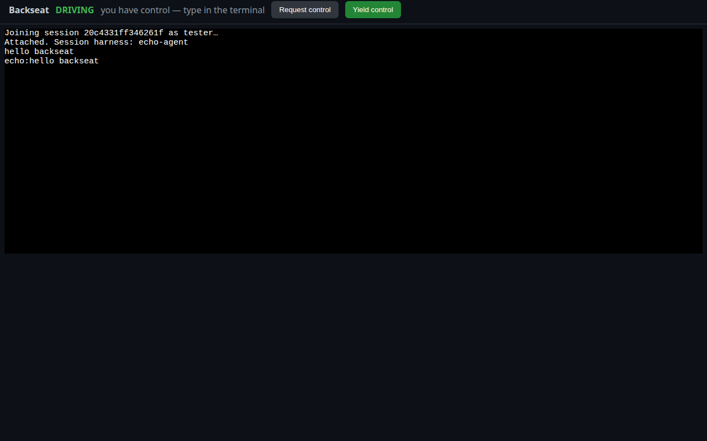

# Backseat


[](https://m8ven.ai/mcp/allanianirudh-backseat-1s9sux?s=readme)



*Verified with a real headless-Chromium click-through: join as viewer, request control, host grants, typed input echoed back through the PTY, yield. Zero JS errors.*

Backseat lets an expert take over someone else's live AI coding agent session. The novice runs one command, shares a one-time link, and the expert opens it in a browser: they see the terminal, request control, and once the novice approves, they drive the agent directly on the novice's machine. It works with any CLI harness (Copilot CLI, Claude Code, OpenCode, Aider) because it captures the terminal, not each agent's private protocol.

## Status: v0.3

Works end to end on localhost: relay, host, and expert clients (browser, TUI). `go build ./...`, `go vet ./...`, and `go test ./...` are green, including in-process end-to-end tests covering HMAC enrollment, encrypted control grant, driven input echoed back through per-expert encryption, input gating (non-controller and post-yield input dropped), control deny, yield/handoff, kick, enrollment-failure kick, pending-enrollment timeout, approval-prompt forwarding with expert answers, checkpoint create/list/rewind, and clean teardown. A live-agent suite drives a real `opencode` CLI session through the whole protocol (opt-in via `BACKSEAT_LIVE_AGENT_TEST=1`, kept out of CI so it never touches your model key).

### What it does

- Captures any agent command in a PTY and streams the output to the host's own terminal and to connected viewers. Structured agent events are the primary channel where adapters exist; PTY mirroring is the universal fallback, so it works with any CLI harness (Claude Code, OpenCode, Cursor, Copilot CLI, Aider) without per-agent private protocols.
- One-time invite links (`{ui}/?session={id}#secret={...}`): 10-minute expiry, the secret stays in the URL fragment so it never hits a server log. Joining experts prove they hold the secret with an HMAC-SHA256 challenge-response; a wrong answer gets them kicked, and the secret itself never crosses the wire.
- End-to-end payload encryption: after enrollment, every host<->expert payload is AES-256-GCM encrypted with directional keys derived locally from the invite secret (HKDF-SHA256). The relay routes opaque envelopes and never sees session content.
- Control handoff with novice consent: request, grant, deny, yield from either side, plus kick and end. Exactly one controller at a time, enforced by the host daemon.
- Approval forwarding: the host watches the PTY for approval prompts (heuristic matcher, extensible via `RegisterApprovalPattern`) and forwards them as one-tap Approve/Deny cards to the expert; the expert's answer is typed back into the agent. Timeouts fail closed (denied).
- Checkpoints and rewind: snapshot the working directory mid-session and restore it later; restores are novice-confirmed.
- `backseat-mcp`: 7 MCP tools (`create session`, `publish progress`, `poll inbox`, `ask approval`, `checkpoint`, `session state`, `end session`) so an in-harness agent can collaborate with the expert structurally instead of through the terminal. Secrets are masked before anything is sent to the expert.
- Expert clients: self-contained browser UI (xterm.js vendored into the `backseat-expert` binary, no CDN needed) and a terminal `backseat-tui` client.
- Host console commands: `grant`, `deny [reason]`, `yield`, `kick <name> [reason]`, `end`, `help`.

### Security posture

The relay is untrusted by design: payloads are end-to-end encrypted and it only ever sees message types, the `to`/`from` routing fields, session ids, and timing. Honest limitations: no forward secrecy yet (a leaked invite secret decrypts that session's recorded traffic; each session gets a fresh secret), no replay protection yet, and no audit log yet. The approval matcher is heuristic and can miss unusual TUIs. See SECURITY.md for the full scope.

### In progress / deferred (see ARCHITECTURE.md roadmap)

- Transcript adapters for structured in-harness mode: Claude/Copilot/Aider adapters exist; the OpenCode adapter is still a stub, so OpenCode currently runs on the PTY-mirroring path (which is live-tested).
- Novice typing directly into the PTY: the host stdin is a command console only.
- NAT traversal / direct transport (v0.4).

## How it works

```
 novice machine                              relay                      expert browser
┌─────────────────────────┐                ┌──────────────┐                ┌──────────────────┐
│ backseat host           │ E2E-encrypted│ backseat     │ E2E-encrypted│ backseat expert  │
│ ┌─────────────────────┐ │ envelopes    │ relay        │ envelopes    │ ┌──────────────┐ │
│ │ agent in a PTY      │─┼──────────────► routes      ├──────────────► │ terminal via │ │
│ │ (claude, copilot…)  │ │              │ opaque       │              │ │ xterm.js     │ │
│ └─────────────────────┘ │                │ envelopes    │              │ └──────────────┘ │
│  ▲                      │                │              │                │  ▲               │
│  │ invite link          │                │              │                │  │ control       │
│  │ #secret=…            │                │              │                │  │ request/grant │
│  └──────────────────────┼────────────────┤              ├────────────────┼──┘               │
│  novice approves in     │  out of band   │              │                │                  │
│  terminal: grant/deny   │  (chat, DM)    │              │                │                  │
└─────────────────────────┘                └──────────────┘                └──────────────────┘
```

1. Novice runs `backseat-host -- <agent command>` and sends the printed invite link to the expert.
2. Expert opens the link, watches the live terminal, and clicks Request control.
3. Novice types `grant` in their terminal. The expert now drives the session.
4. Either side can end it: the novice types `end`, the expert clicks Yield control.

Payloads are end-to-end encrypted from the pairing keys, so the relay never sees session content — only message types, routing fields, and timing.

## Quickstart

Prerequisites: Go 1.25+.

```bash
# terminal 1: relay (WebSocket on :8080, /ws and /healthz)
go run ./cmd/backseat-relay --addr :8080

# terminal 2: expert web UI (serves invite links on :8081)
go run ./cmd/backseat-expert --port :8081 --relay-ws ws://localhost:8080/ws

# terminal 3: novice host (prints the one-time invite link)
go run ./cmd/backseat-host --relay ws://localhost:8080 --ui http://localhost:8081 \
  --name novice -- claude
```

Any command works after `--`: `claude`, `copilot`, `opencode`, `aider`, or for a dry run with no agent installed:

```bash
go run ./cmd/backseat-host --relay ws://localhost:8080 --ui http://localhost:8081 -- \
  sh -c 'while IFS= read -r line; do printf "echo:%s\n" "$line"; done'
```

Open the printed link in a browser. The secret stays in the URL fragment, so it never hits a server log. Click Request control, type `grant` in the host terminal, and type into the browser terminal: your keystrokes drive the agent. Host console commands: `grant`, `deny [reason]`, `yield`, `kick <name> [reason]`, `end`, `help`.

## Contributing

See CONTRIBUTING.md. Issues and PRs welcome. Keep changes small and focused, add tests for protocol and pairing changes, and do not add per-harness private protocol integrations: the PTY plus transcript adapters is the whole strategy.

## License

MIT. See LICENSE.
